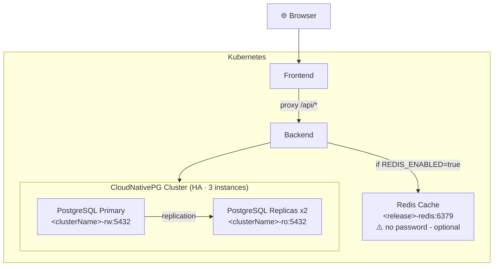

# Full Stack App Blueprint

A Krateo blueprint that provisions a complete full-stack application environment on Kubernetes:

- **PostgreSQL** — via [CloudNativePG](https://cloudnative-pg.io/) (CNPG) operator
- **Redis** (optional) — via [OT-CONTAINER-KIT](https://github.com/OT-CONTAINER-KIT/redis-operator) operator; toggled with `app.redis.enabled`
- **Backend** — any containerised HTTP service; connects to the database and optionally to Redis
- **Frontend** — any containerised web server; proxies API requests to the backend

---

## Prerequisites

- **CNPG Operator** is already deployed with a standard Krateo installation.

- **Redis Operator (OT-CONTAINER-KIT)**:
```bash
helm repo add ot-helm https://ot-container-kit.github.io/helm-charts
helm upgrade --install redis-operator ot-helm/redis-operator \
  --namespace ot-operators --create-namespace

kubectl wait deployment/redis-operator \
  --namespace ot-operators \
  --for=condition=Available \
  --timeout=120s
```

---

## Architecture



### Authentication & connectivity details

**PostgreSQL (CNPG)**

CNPG bootstraps the cluster with a dedicated database and owner matching `metadata.name` (the Helm release name), then **automatically generates** a Kubernetes Secret named `<clusterName>-app`. Credentials are injected in the backend as environment variables from that secret:

| Env var | Source |
|---|---|
| `DB_HOST` | ConfigMap → `<clusterName>-rw.<namespace>.svc.cluster.local` |
| `DB_PORT` | ConfigMap → `5432` |
| `DB_NAME` | ConfigMap → Helm release name |
| `DB_USER` | Secret `<clusterName>-app` → key `username` |
| `DB_PASSWORD` | Secret `<clusterName>-app` → key `password` |

**Redis**

Redis is deployed via the OT-CONTAINER-KIT operator **without any password or TLS**. The instance is only reachable inside the cluster. The backend connects only when `REDIS_ENABLED=true` is set in the backend ConfigMap, which is rendered from Helm values. This allows the blueprint to support Redis as an optional component. 

| Env var | Value |
|---|---|
| `REDIS_ENABLED` | `"true"` / `"false"` (default `"false"`) |
| `REDIS_HOST` | `<release>-redis.<namespace>.svc.cluster.local` |
| `REDIS_PORT` | `6379` |

---

## Key values

| Value | Default | Description |
|---|---|---|
| `app.backend.image.repository` | — | Backend container image repository |
| `app.backend.image.tag` | `latest` | Backend container image tag |
| `app.backend.service.type` | `NodePort` | Backend service type |
| `app.backend.service.port` | `30086` | Backend NodePort |
| `app.frontend.image.repository` | — | Frontend container image repository |
| `app.frontend.image.tag` | `latest` | Frontend container image tag |
| `app.frontend.service.type` | `NodePort` | Frontend service type |
| `app.frontend.service.port` | `30088` | Frontend NodePort |
| `app.redis.enabled` | `false` | Enable Redis cache |
| `app.redis.image` | `quay.io/opstree/redis:v7.4.8` | Redis image (enum: v7.4.8 / v8.0.6 / v8.2.5) |
| `app.redis.storage` | `1Gi` | Redis PVC size (enum: 1Gi / 2Gi / 3Gi) |
| `app.cnpg.clusterName` | `pg-cluster` | CNPG Cluster resource name |
| `app.cnpg.postgresVersion` | `18` | PostgreSQL major version (enum: 16 / 17 / 18) |
| `app.cnpg.instances` | `3` | Number of CNPG replicas |
| `app.cnpg.storage.size` | `1Gi` | CNPG PVC size per instance (enum: 1Gi / 3Gi / 5Gi) |
| `testing.loadTesting.enabled` | `true` | Deploy a load-test CronJob |
| `testing.loadTesting.schedule` | `*/5 * * * *` | CronJob schedule |
| `testing.loadTesting.scriptImage` | — | Load-test container image |

Full schema: [`blueprint/values.schema.json`](blueprint/values.schema.json)

---

## Install using Krateo Composable Operation

**1. Register the blueprint** by creating a `CompositionDefinition`:

```sh
cat <<EOF | kubectl apply -f -
apiVersion: core.krateo.io/v1alpha1
kind: CompositionDefinition
metadata:
  name: full-stack-app
  namespace: demo-system
spec:
  chart:
    repo: full-stack-app
    url: https://marketplace.krateo.io
    version: 0.0.16
EOF
```

Wait for it to be ready:

```bash
kubectl wait compositiondefinition/full-stack-app \
  --namespace demo-system \
  --for=condition=Ready \
  --timeout=120s
```

**2. Deploy an instance** by creating a `FullStackApp` resource. Use `metadata.name` as the Helm release name and `metadata.namespace` as the target namespace:

```sh
cat <<EOF | kubectl apply -f -
apiVersion: composition.krateo.io/v0-0-16
kind: FullStackApp
metadata:
  name: fsa-1
  namespace: demo-system
spec:
  app:
    backend:
      service:
        type: ClusterIP
    frontend:
      service:
        type: NodePort
        port: 30088
    redis:
      enabled: false
      image: quay.io/opstree/redis:v7.4.8
      storage: 1Gi
    cnpg:
      clusterName: pg-cluster
      postgresVersion: "18"
      instances: 3
      storage:
        size: 1Gi
  testing:
    loadTesting:
      enabled: false
EOF
```

Wait for the composition to be ready:

```bash
kubectl wait fullstackapp/fsa-1 \
  --namespace demo-system \
  --for=condition=Ready \
  --timeout=300s
```
