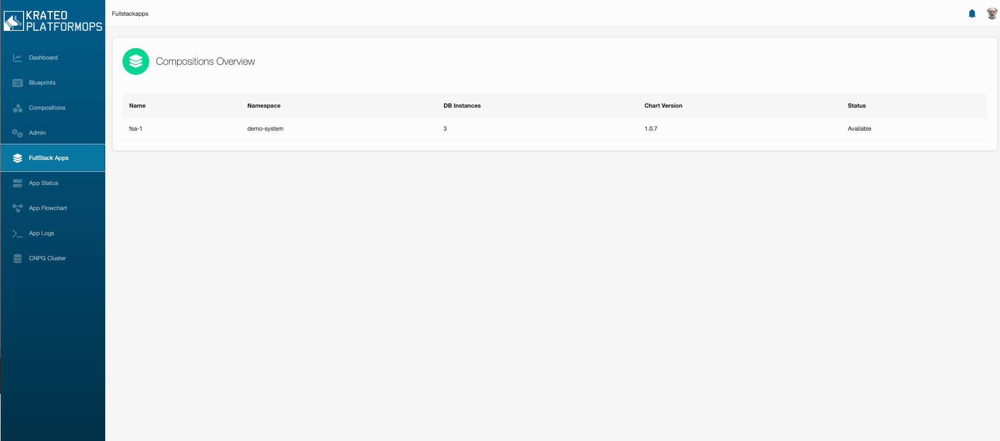
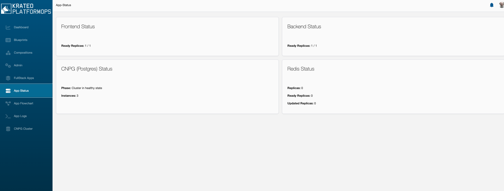
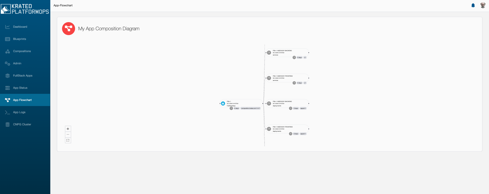
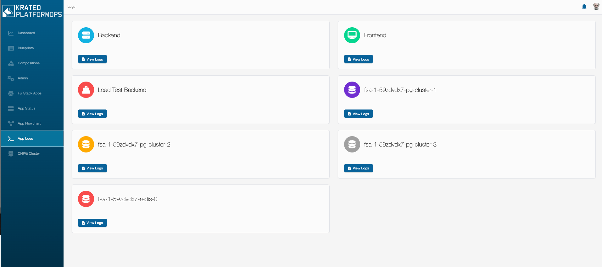
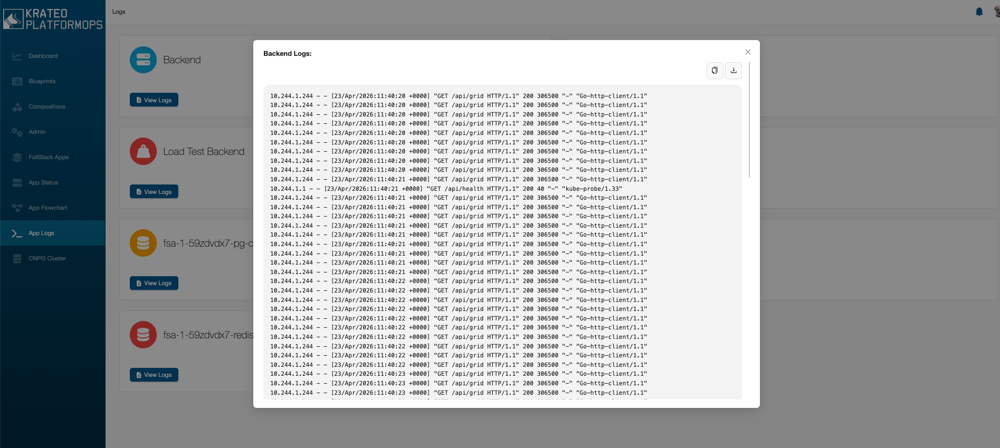
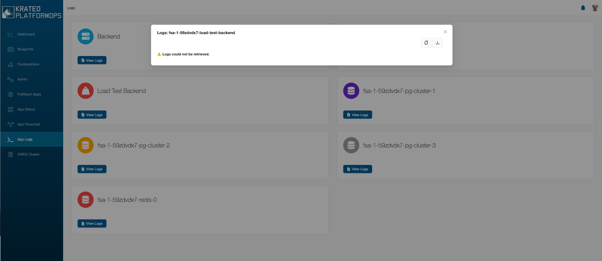
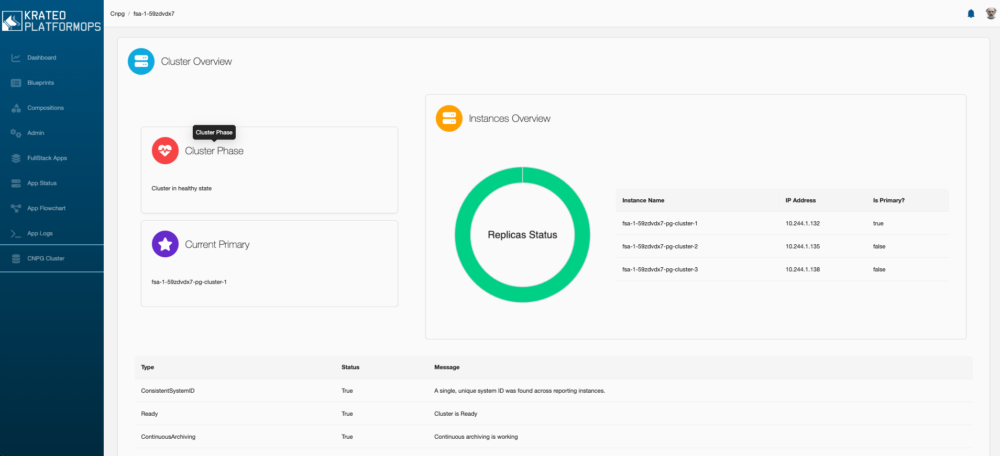

# Krateo Portal Reference

This page provides a reference for the final results we aim to achieve in the workshop.

## Page 1

Page 1 should contain a table with a list of the "FullStackApp" compositions deployed in the cluster, along with their status and some other relevant information.

## Page 2

Page 2 is a simple dashboard showing the status of the 4 main components of the "FullStackApp" composition: frontend, backend, database and Redis. The status is determined by the status of the underlying Kubernetes resources (e.g. Deployments, StatefulSets, Clusters (CNPG), etc.).

## Page 3

Page 3 should contain a widget of type "Flowchart" showing the components of the "FullStackApp" composition.

## Page 4

Page 4 should contain a set of panels that retrieves and shows logs of the pods of the "FullStackApp" composition.

## Page 5

Page 5 shows details related to CNPG, which is the PostgreSQL operator used in the "FullStackApp" composition.

